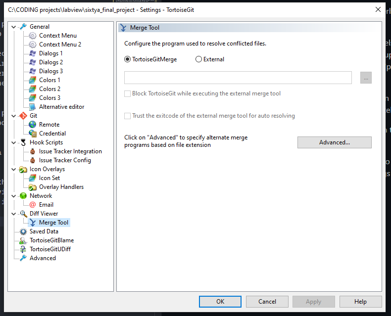

<h3 align="center">
60a final project 
</h3>

---

coding in labview to make a heartbeat sensor

this repo will have all of our vi's. the actual project vi is in the "projects" folder

i tried making a thorough guide on getting setup using git and using it to share our code. there's also a section detailing how to uninstall all the softwares we use if you don't want to keep them

this is an attempt to make our code more convenient to share, but if it is too cumbersome, we can just use google drive

---

## Setup Guide

* [Git & TortoiseGit Install](#git--tortoisegit-install)
* [Add Git to Path](#add_git_to_path)
* [Getting Our Code](#getting-our-code)
* [Setup TortoiseGit with LabVIEW](#setup-tortoisegit-with-labview)
* [Using TortoiseGit with LabVIEW](#using-tortoisegit-with-labview)
* [Handling a Merge Conflict](#handling-a-merge-conflict)
* [Uninstalling Git and TortoiseGit](#uninstalling-git-and-tortoisegit)

## Git & TortoiseGit Install

First things first, we need to install Git and TortoiseGit to use them with LabVIEW.

To briefly explain what each software does:

***Git*** is a software that can track your files as you update them, allowing you to very easily manage the history of your code and safely test new features without breaking your existing code.

***GitHub*** is simply a website that allows people to share the projects that they're tracking using Git. You can think of it like a middleman; someone uploads code, then everyone else can see and edit that code through GitHub.

***TortoiseGit*** is an app that lets you more easily use Git. We avoid using command prompt by using TortoiseGit, which makes Git more convenient and easy to use.

1. Open command prompt as administrator and run the following command:

`winget install --id Git.Git`

This will install git, which is the software we're using to track the changes in our code.

Close command prompt and reopen it, and try running this command:

`git --version`

If you see this:

Then you're good. But, if is says something along the lines of "git is not recognized," then the solution will probably be in the "Add Git to Path" section. In the meantime though, you can just move onto step 2.

2. Now, install TortoiseGit by running:

`winget install --id TortoiseGit.TortoiseGit`

When this is done, try searching for TortoiseGit in your Windows search. If it comes up, you're good. If not, you can go to the "Add Git to Path" section and it should be the same process to add TortoiseGit to your Path.

3. Link Git to your GitHub account.

You'll need a GitHub account, but it's really easy to link Git to your GitHub account.

In command prompt, run these commands:

`git config --global user.name "UserName"`
`git config --global user.email MyEmail@gmail.com`

Just make sure to type in your actual username and email. Only the username one needs to have the quotes around it, so if I were to do this again with my uci email, it would look like:

`git config --global user.name "whatamidoinglmao"`
`git config --global user.email elintag@uci.edu`

## Add Git to Path

This section is optional, if you're struggling with the Git and TortoiseGit install.

This sounds weird, but you can think of adding a program to your Path as making it easier for other programs to easily find it, which is important for using Git and TortoiseGit.

1. Search "Edit system variables" in your Windows search. An option like this may come up:

(I am on Windows 10 so if you have Windows 11 it may look different)

2. Select that and you'll see a screen like this:

3. Select the "Environment Variables" button on the bottom right, and now you'll see this:

There are two lists: "User variables" on the top and "System variables" on the bottom. In both lists, there is an option called "Path."

If you plan on keeping Git, you can edit the system variable Path (highlighted in grey). If you don't, you can edit the user variable Path (highlight in blue).

4. Either way, it shouldn't matter too much which one you choose. Double click one of the "Path" options to open the edit screen:

5. Click the "New" button and type in:

`C:\Program Files\Git\cmd`

It should match the bottom of mine shown above. This is the folder that Git normally installs into, so hopefully your Git version isn't randomly installed somewhere else.

If TortoiseGit isn't working, you can add another:

`C:\Program Files\TortoiseGit\bin`

6. Open command prompt and check if this worked by again running:

`git --version`

If it still doesn't work, close command prompt and wait a bit, then do it again. If you open/close command prompt a couple times and it still doesn't work, then you might've typed the wrong directory and/or Git was installed somewhere else, which we can help troubleshoot in our discord if you can't get past this step.

TortoiseGit should also show up if you search for it as an app, so again, if it still doesn't after adding to your Path, we can try to help troubleshoot.

## Getting Our Code

Now, we have to get the code from GitHub, which is pretty straightforward.

1. Go to your folder that has all of your LabView projects (or really, the folder you want to put our project in)

2. Right click anywhere in the folder. If TortoiseGit was installed correctly, you should see it as one of the options. You want to select the option "Git Clone..."

3. Copy the link of this webpage and put it into the URL option, and make sure to select the "Recursive" option. It'll look like:

You could rename the "FOLDER_NAME_HERE" section to the name of the folder you want to put the project in. I think it defaults to being named "60a_final_project," but you can replace that with anything.

The new folder should be created, with all of our current code.

## Setup TortoiseGit with LabVIEW

There's just one thing you need to do before you can properly use TortoiseGit with LabVIEW, which is to setup the LabVIEW Merge app to TortoiseGit.

When you work on the VI's, there's a chance that someone else is working on it at the same time. If the other person uploads their work first, when you go to upload, Git will tell you to merge the other person's code first. So, you run the "Pull" command, which "pulls" their new code into your copy, and Git can usually handle this by itself. 

BUT, if you worked on the same things that the other person did, then there's a "merge conflict," meaning Git doesn't know whose code to trust and will need you to tell it what to keep. There's more details about merge conflicts in a further section.

Git is used to working with text files and can't understand a VI, so you need a program that can merge VI's together. Luckily, LabVIEW already has that.

1. Right click in your folder that has our project, then go to TortoiseGit>Settings. A message box might come up giving you some details about how Git settings work, but when you click past it, you'll see this:

2. Click "Advanced..." and add a new option. In file extension, write ".vi". For the external program, write the following line:

`"C:\Program Files\National Instruments\Shared\LabVIEW Merge\LVMerge.exe" %base %theirs %mine %merged`

An important part is that the path within the quotes is the path to your LabVIEW Merge app, wherever that "LVMerge" file is. I'm hoping you all have the same path, but your LabVIEW might be installed somewhere else on your computer, so you might have to search for the right path in your own computer.

Anyways, it should end up looking like this:

You can hit "OK" to exit that menu, but make sure you hit "Apply" before you exit the next menu to save that change. Now, TortoiseGit can point to LVMerge if you ever have a merge conflict.

## Using TortoiseGit with LabVIEW

The main worflow of using TortoiseGit is this:

1. Before you do any new work, download (or "pull") the changes anyone else might have added.

You can do this by right clicking in the folder with the project, hover over the TortoiseGit option, then click the "Pull" option:

A menu will come up, but just hit "OK" or whatever it says to move on. This will "pull" all of the changes from GitHub into your own computer.

2. Do all your work, then when you're done, go back to the folder and right click to pull up TortoiseGit. Select the "Diff" option. You'll see something like this:

3. Hit the "Commit" button and a new menu will come up:

Type in whatever you did in the message text box, as this message will appear in GitHub for other people to quickly see what you did. When you hit the "Commit" button, it will commit all your changes in Git. A new menu will popup, and you want to hit the "Push" button

4. Upload (or "push") your changes to GitHub

After you hit the "Push" button a menu will come up, but you can just hit "OK" or whatever to continue. This will "push," or upload, all of your changes to the folder on GitHub, and now everyone else will be able to access it.

You can also "push" the same way you "pull," just right-clicking in the folder and going through TortoiseGit to the push option, which will push any commits you may have made during your work session.

## Handling a Merge Conflict

There's a chance that when you go to push your changes, it'll fail and probably say something like "there are changes that you don't have" or something like that. If that happens, that means someone else has pushed some changes before you and you need to download their new code before you can upload yours. Easy enough, just pull through TortoiseGit.

But, there is a solid chance that trying to pull makes a "merge conflict," meaning you've committed changes that conflict with the changes that were pushed before you. If that's the case, you need to:

1. Right click on the VI that has the conflict, go through TortoiseGit, and hit the "Edit conflicts" option (you can tell it's the affected VI if there's a little caution symbol over the picture). If you setup TortoiseGit with LVMerge.exe right, it should open a shit ton of VI's:

The left side of the screen will have three VI's. The top one has the current status on GitHub, the bottom one has all of your current changes, and the one in the middle has neither of your changes.

In this case, someone pushed a change where they added a button (top), but I added a gauge (bottom) before pulling their changes. Git expected my VI to look like the one in the middle (with no changes, neither the gauge nor button). But it doesn't, so a merge conflict happens.

The right side of the screen actually handles the merge. The top is what the VI will look like after the merge, and the bottom has a detailed menu with all the conflicts. You can click through each conflict and choose whose changes to take. 

2. If the top right VI already looks like it's merging correctly, you don't have to mess with the bottom right menu. But if the top right VI looks wrong for whatever reason, you can change some of the choices of what to keep in that Merge menu. You can also just manually edit the top VI until it looks right if you don't want to deal with that.

3. Once the top right VI looks good, you can hit the Close button on the bottom right and save the merged VI. 

4. Go back to the project folder, and now there's going to be 3 new VI's with names like BASE, LOCAL, and REMOTE. Ignore those and right click on the original VI, go to TortoiseGit, and hit "Resolve conflict..."

5. Some menus will pop up, just click through them until there's an option to "Commit." You want to commit the resolved merge conflict, then Push it to GitHub. All of the following menus should make it a straightforward process. 

And there you go, the merge conflict is done.

## Uninstalling Git and TortoiseGit

So the project is done and you don't want these random programs cluttering your computer. It's easy to uninstall, just run some commands like during the install:

1. To uninstall Git, open command prompt and run:

`winget uninstall --id Git.Git`

2. To uninstall TortoiseGit, run:

`winget uninstall --id TortoiseGit.TortoiseGit`

